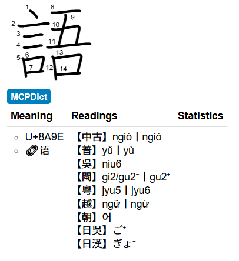

# 漢字古今中外讀音查詢 MCPDict for Yomitan

A Pronunciation Dictionary for Yomitan, including pronunciations of Han Characters in:

- Chinese, Middle
- Chinese, Madarin
- Chinese, Wu
- Chinese, Min
- Chinese, Yue
- Vietnamese
- Korean
- Japanese Go-on
- Japanese Kan-on
- Japanese Tō-on
- Japanese Kan'yō-on

etc.

Database comes from [MaigoAkisame/MCPDict](https://github.com/MaigoAkisame/MCPDict).
